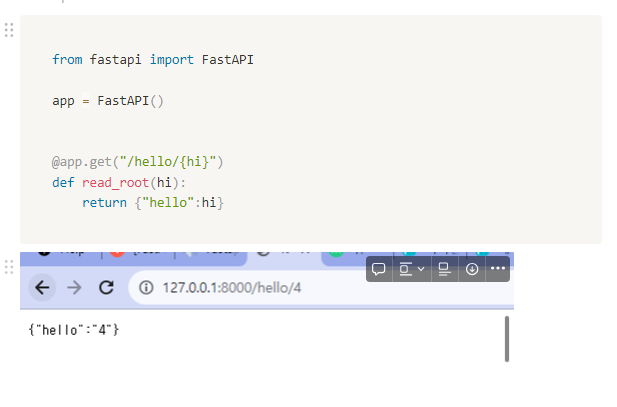

## Fastapi란

- api를 만들기 위한 파이썬 웹 프레임 워크 (사실은 집에 가고 싶었어)
    - api란 Application Programing Interface로 서비스 요청과 응답을 처리하는 서비스
    
- 기존과의 차이점
    - 기존 웹프레임워크는 장고와 플라스크 → 주로 웹서비스를 만들때
    - Fastapi는 api(요청 응답 처리) 에 집중
    - 여기서 작성된 api는 리액트나 Svelte같은 웹 프레임 워크에서도 사용가능
    - 여러 클라이언트에서 변경 없이 사용 가능
- 속도가 빠름
    - 파이썬 웹프레임 워크중 가장 빠름
    - 내부적으로 Starlette사용 하기 때문
    - 노드나 go 와 대응 할정도

- 빠르게 작성 할 수 있다
    - 보통은 입출력 정하고 기능 구현 → 테스트
    - 입출력 정의하고 입출력 검증을 빠르고 안전하게 가능(pydantic)가 가능하게 함
    - 작성한 api는 자동으로 생성되는 API문서 통해 테스트가능(Swagger)

- 테스트 가능
    - api문서가 자동으로 웹페이지 형태로 제공 API동작 테스트

- 기본예제
```
from fastapi import FastAPI
app = FastAPI()
@app.get("/hello")
def hello():
return {"message": "안녕하세요 파이보"}
```
- get 동작 활용
    - 어노테이션 hello라는 경로로  요청이 발생하면 해당 함수 실행 하라는 의미
        
        유비콘(비동기 호출을 지원하는 파이썬용 웹 서버)
        
        - get이 아닌 다른 동작들도 가능
            - `@app.post()`, `@app.put()`, `@app.delete()`,
            - `@app.options()`, `@app.head()`,`@app.patch()`, `@app.trace()`
        
        - url동작을 받을때마다 Fastapi에 의해 파이썬 함수 호출

- 터미널에 설치
    - (myapi) c:/projects/myapi> pip install "uvicorn[scdtandard]


    ## 경로 매개변수

- 매개변수 또는 변수를 경로에 선언 가능
```
from fastapi import FastAPI

app = FastAPI()


@app.get("/items/{item_id}")
async def read_item(item_id):
    return {"item_id": item_id}
```

- 설명
    - 앞에는 똑같지만 get의 매개변수가 경로매개변수
    - 여기에 /하고 넣으면 경로 가 된다
        - 그냥 넣지 않고 이렇게 {}하고 넣고 함수의 매개변수로 넣으면  내가 경로후 마지막에 넣은 걸로 바뀜
        - 일단은 str타입
        - 이걸 타입을 바꿀려면 매개변수 두 : int이렇게 바꿔주면 됨
        - 근데 이렇게 하고 int가 아닌게 오면 오류가 남 type error

        
        지금은 이게 경로가 4가 붙어서 hello:4로 나오는데  /5로 바꾸면 hello:5로 나옴
        
# Jinja2

- 파이썬에서 쓸 수 있는 템플릿 엔진
- Django 템플릿을 모델로
- pip install Jinja2 하면
    - 템플릿 엔진이란  정적 템플릿(html)과 동적 데이터 결합해 최종 출력 생성
    - 주로 HTML을 동적으로 생성 할때 사용
    - 그러니까 원래 html은 정적인데 이걸 진자와 결합하면 동적이 된다
```
    from fastapi import FastAPI, Request
from fastapi.templating import Jinja2Templates
from starlette.responses import HTMLResponse

app = FastAPI()

# 템플릿 디렉토리 설정
templates = Jinja2Templates(directory="templates")

@app.get("/")
def read_root(request: Request):
    # HTML 템플릿을 사용하여 렌더링
    return templates.TemplateResponse("test.html", {"request": request})
  ```
  Jinja2Templates: 

- HTML파일을 랜더링 하고(정적을 동적으로 바꿈)
- 템플릿이 위치한 디렉토리 설정(위치 알려주기?)

return templates.TemplateResponse

- HTML파일을 HTML Response로 반환해서 띄워줌
- 코드 설명
    - app을 fastapi 인스턴스로 생성
    - 템플릿은 진자 템플릿으로 선언(경로는 templetes 폴더에 있다 )
    - 경로로 요청이 왔을때 templete을 HTMLResponse로  반환(test.html을 요청받아서 띄움)
        - request가 여기에 요청메서드 , URL,등 데이터 들어있음
        
- 여기에 정적이 아닌 동적으로 할려면 html에{{}}안에 쓰면 됨
```
from fastapi import FastAPI
from fastapi.templating import Jinja2Templates
from starlette.responses import HTMLResponse

app = FastAPI()
templates = Jinja2Templates(directory="templates")

@app.get("/", response_class=HTMLResponse)
async def read_item():
    username = "John"
    return templates.TemplateResponse("index.html", {"request": request, "username": username})
```

```
<h1>Hello, {{ username }}!</h1>
```
html이 이렇게 있으면 username에 John이 들어감

username바꾸면 HTML파일의 {{username}}이 John으로 바꿔서 들어감