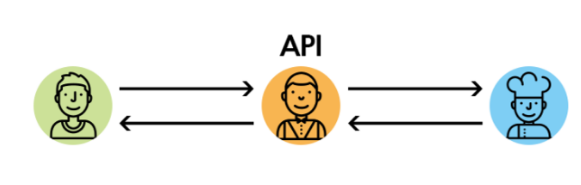
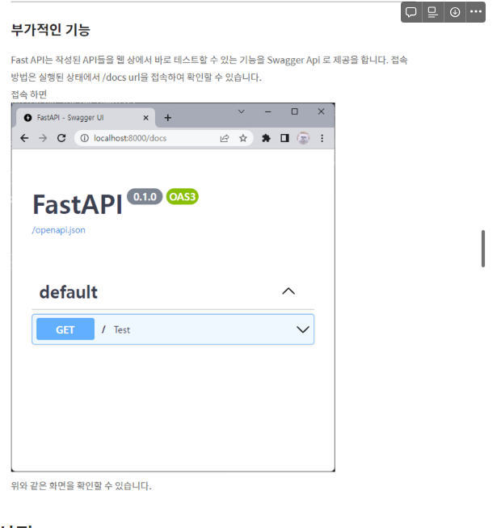
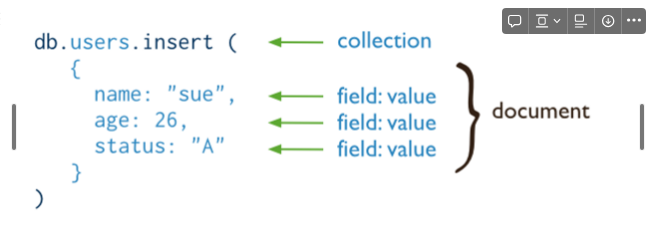
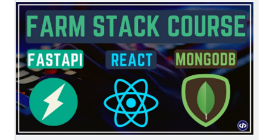

# 1. FAST API란?

- api란?
Application Programing Interface로 서비스 요청과 응답을 처리하는 서비스
- 다른 소프트 웨어 구성요소 혹은 서비스와 상호작용 하기 위한 인터페이스를 제공
- api는 서버 와 데이터 베이스에 대한 출입구 역할을 한다
- api는 프로그램의 명령 목록을 정리하고 응용 프로그램과 상호작용 해 값을 전달

- fast api는 api 서버를 구축하기 위한 웹 프레임 워크
- 주특징으로는 노드나 go에 대응 할 정도로 빠르다 (비동기 동작)
- api문서 자동 생성
- 적은 버그와 높은 생산성
- 베우기 쉽게 되어 있는 공식 문서
- 파이썬 언어에서 오는 여러 라이브러리 사용 가능의 장점
- 플라스크는  문서의 자동화가 안되지만 fast api는 3가지 엔드포인트 발생 /docs, /redoc, /openai.json
- 데이터 타입을 앤드포인트로 명시하지 않아도 된다
    - end point란  api가 서버에서 리소스에 접근 할 수 있도록 기능하게 해주는 URL
    - request 를 받는다고 가정 하면 이걸 받을 지점이 필요  → 이 위치를 endpoint라고 한다
    

    ## 2. 시작

- 먼저 fastapi와 uvicorn을 설치
- `$ pip install fastapi 'uvicorn[standard]'`
    - uvicorn이란?
    - ASGI 한 종류로 fast api와 함꼐 비동기적으로 작동함
    - • Asynchronous Server Gateway Interface의 약자 비동기 웹 서버
    

    매우 가벼운 ASGI 서버

파이썬 프레임 워크 만으,로는 웹 개발을 할 수 없고 ASGI와 호환되는 웹 서버 필요

- FAST API와 uvicorn을 사용해 서비스 배포 가능
- `uvicorn main:app --reload`(서버를 생성 한다는 의미)
- uvicorn 서버를 생성하겠다 main(모듈 → 여기서는 파일)
- app fast api 로 부터 생성 된 인스턴스를 의미
- -reload : 코드 수정시 새로고침됨을 의미합니다

일단 요청이 들어오면 이 아래있는 함수를 실핼 하겠다

def로 요청이 들어오면 할일 만들어 설정 하고 return값 주기 그냥 이라도 html만 주면 안되고 request:Request 줘야함

## 진자2란?

jinja2란 파이썬엣서 많이 사용되는템플릿 엔진 중 하나 

Django에서 영감을 얻었지만 확장 됨

- 템플릿 엔진이란?
    - 정적 템플릿(html)과 동적 데이터 결합하여 최종 출력을 생성 한다
    - 정적인 HTML을 동적으로 바꿔준다
    - 진자2가 해당 HTML문법을 템플릿으로 만들고 안의 파이썬 코드를 실행
    - 템플릿을 체운 후 최종 HTML파일을 만듬
    - {{ 변수명}}
    - {{% 파이썬 소스코드}} 여기에 끝에 for 나 if면 {{forend}} 이런 식으로 붙은다
    - 주석은{# #}

```
  return templates.TemplateResponse("review.html", {"request": request, "documents": documents})


  return templates.TemplateResponse('랜더링 할 html', 브라우저로 전달되는 변수이름=내용)
  ```
  이렇게 여러개도 전달 할 수 있다

  - TIP

`{{ }}` 안에 뭐가 들어갈지 모른다. 그렇기에 이를 다룰 수 있는 방법이 있다.

`{{ name | x }}` `x의 종류는 아래와 같다.`

- safe - html tag를 정상 적용
- striptags - html tag를 제거
- lower - 소문자로 만듬 //
- upper -대문자로 만듬
- title - 단어의 첫 글자들을 대문자로 만듬
- trim - 마지막 공백을 제거

진자2의 대 표적인 로직은 include, extends

- include
- include는 HTML을 부분부분 나누어 재사용 가능한 형태로 가공하는 기능이다
- 중복되는 부분 가지고 오는것
```
<!--head.html-->

<!DOCTYPE html>
<html lang="en">
<head>
    <meta charset="UTF-8">
    <title>hello world!</title>
</head>
```
이렇게 header 부분만 있는 파일읋 만듬

이걸 그대로 재사용 하고 싶다! 바꿀꺼 없다! 그냥 가지고 오고 싶다!

- `` 이렇게 사용
```
<!--index.html('head.html' include 후)-->


<body>
    <h1>my body!</h1>
</body>
</html>
```
간결하고 보기 쉽게 만들 수 있고 어디든지 가져다가 붙일 수 있어 유지보수에 좋다

-  extends
    - html을 상속받아 한 부분을 상황에 맞게 바꿔 쓸 수 있는 기능이다
    - 그냥이 아니라 그 사이에 뭔가를 집어넣는거지
```

상황별로 바꾸고 싶은 내용

```
각 페이지에 맞게 바뀔 부분을 원래 에서 열고 으로 닫아줘야 한다

기본틀을 설정하는 것

- 그니까 기존의 파일안에





이런 구역을 만들어놓고 이안에  html파일이 들어갈 공간을 만든것

부모 템플릿에 정의된 블럭의 내용을 보여주려면 `{{ super() }}` 를 사용

지금 드는 생각은 두개의 css가 되니까 블럭을  로 열고 거기에 넣고  으로 닫고

## 경로

1. 먼저 서버를 열였다 → 이 서버의 주소로 열어달라는 요청을 받았다  → 그럼 그 아래 있는 부분이 실행
2. 진자2에 의해 거기에 있는 템플릿에 같이 return 한 값들이 들어가게 됨
3. 여기서 js에 있는 ajax를 통해 다시 url로 데이터를 보내게 된다 (이건 post/get 방식 선택 가능)
4. 근데 왜 페이지 열때는 post로 안되는 거야 
5. 그리고 중간에 해싱한거는 비밀번호 헤싱해서 넣은것 → 해싱은 다시 원래 값으로 바꾸기 어려움
6. 그러나 같은 값이 들어오면 항상 같은 값으로 해싱이 됨

## 몽고디비란?

NOSQL

NOSQL은 관계형 데이터 베이스가 아니다 라는 뜻이다 

대용량 데이터 처리가 가능한 데이터 베이스 

고성능, 고가용성, 쉬운 확장성을 제공하는 도큐먼트 기반 데이터 베이스 이다 

**Document**

MongoDB에서의 기본 데이터 단위로 관계형 데이터베이스의 행과 유사합니다.

document는 JSON 형식에 저장된 필드와 값 쌍으로 구성됩니다.


• 스키마를 고정하지 않는 형태이기 때문에 스키마 변경으로 오는 문제가 없고, 데이터를 구조화해서 Json 형태로 저장 (데이터를 Key_Value화하여 저장)

Join 이 불가능하기 때문에 Join이 필요없도록 데이터를 설계해야 한다(속도 때문애)

거의 FAST API나 몽고나 속도에 미친거네 속도 때문에 모든걸 버리고ㅓ 오는거임?

쌓아놓고 삭제할 필요가 없는 데이터 에 적합(로그, 세션)

- 도큐먼트 데이터 모덜
    - 데이터를 종이문서 설계하듯 설계 한다
    - 이름과 값으로 이루어진 쌍의 집합
    - 배열 또는 다른 도큐먼트를 지정하는 것도 가능
    - 하나의 document에 필요한 정보를 모두 담아야 함
    - 하나의 쿼리로 모두 해결이 되도록 collection model 설계를 해야 함
    
- 장점:
    
    다양한 형태의 데이터 저장 가능하고 데이터 모델의 유연한 변화 가능
    
    많은 양의 데이터에 대한 성능이 빠름
    
    제이슨 형식으로 사용방법이 쉽고 개발이 편리
    
    빅데이터 처리에 특화 빠름
    
- 단점

조인시 성능 제약이 있을 수 있음

데이터 공간 소모가 많음(불필요한 키 중복 입력)

파이썬과 연동해 PYMONGO 사용

둘다 빠름빠름 이여서 공식문서에 완벽한 동반자라고 나와있네

FAST API, REACT, MONGODB합쳐서 “FARM stack”이라고 함

개발을 보다 빠르게 만들수 있는 간단한 형태의 개발 스택

FARM 스택은 데이터베이스, 백엔드 및 프론트엔드 기술을 포함하는 풀 스택 개발 스택의 하나입니다. FARM은 다음의 기술들을 나타냅니다:

- **FastAPI**: FastAPI는 Python 기반의 웹 프레임워크로, 빠른 속도와 간편한 사용성을 제공합니다. 비동기 작업을 지원하고, OpenAPI 및 Swagger로 API 문서를 자동으로 생성하는 기능을 갖추고 있어 개발자들에게 매우 편리한 선택지입니다.
- **React**: React는 페이스북에서 개발한 JavaScript 라이브러리로, 사용자 인터페이스를 만들기 위한 라이브러리입니다. 컴포넌트 기반의 접근 방식을 사용하여 재사용 가능하고 유지보수가 쉬운 UI를 구축할 수 있습니다.
- **MongoDB**: MongoDB는 NoSQL 데이터베이스로, 문서 지향형 데이터 모델을 사용합니다. JSON과 유사한 BSON 형식의 문서를 저장하며, 유연하고 확장 가능한 데이터베이스 솔루션으로 널리 사용됩니다.

FARM 스택은 백엔드에서 FastAPI와 MongoDB를 사용하여 데이터를 처리하고, 프론트엔드에서 React를 사용하여 사용자 인터페이스를 구축합니다. 이러한 조합은 빠른 개발과 유연성을 제공하여 웹 애플리케이션을 구축하는 데 도움이 됩니다.

—from gpt

먼저 파이썬 보고 html보고 연결된 js

요청이 어디로 가고 그게 뭘 실행 하는지 보면 됨